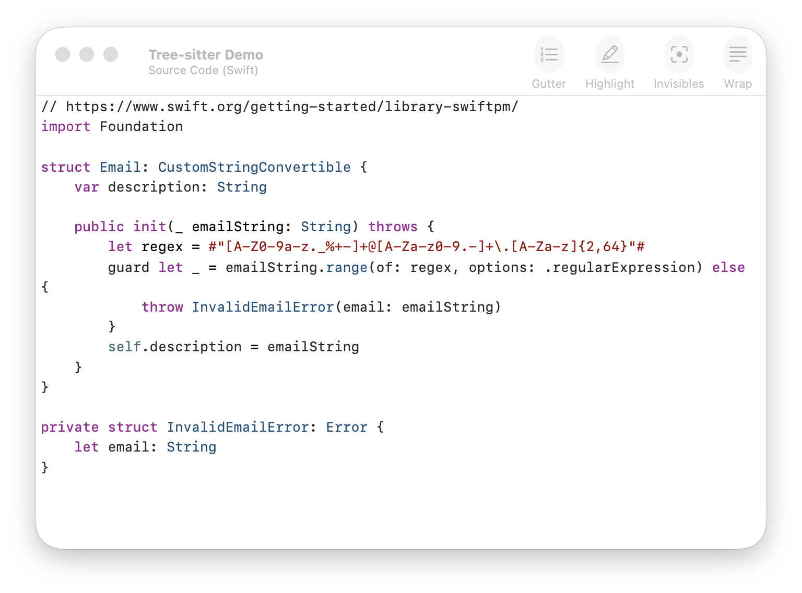

# STTextView Tree-sitter Plugin

[STTextView](https://github.com/krzyzanowskim/STTextView) source-code syntax highlighting with [Tree-sitter](https://tree-sitter.github.io/tree-sitter/).



## Installation

Add the plugin package as a dependency of your application, then register it with an STTextView instance:

```swift
import STPluginTreeSitter

textView.addPlugin(
    TreeSitterPlugin(
        theme: .default,
        language: .swift
    )
)
```

SwiftUI:

```swift
import SwiftUI
import STTextViewUI
import STPluginTreeSitter

struct ContentView: View {
    @State private var text: AttributedString = ""
    @State private var selection: NSRange?

    var body: some View {
        STTextViewUI.TextView(
            text: $text,
            selection: $selection,
            options: [.wrapLines, .highlightSelectedLine],
            plugins: [TreeSitterPlugin(theme: .default, language: .swift)]
        )
        .textViewFont(.monospacedDigitSystemFont(ofSize: NSFont.systemFontSize, weight: .regular))
        .onAppear {
            loadContent()
        }
    }

    private func loadContent() {
        // Load source text here.
    }
}
```
